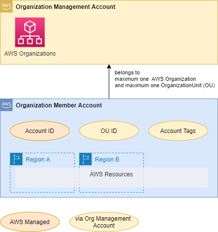

# Content <a id="top"></a>
- [Intro](#intro)  
- [SEMPER Policy-Repository](#policy_repository)  
- [SEMPER Policy-Elements](#policy_elements)  
  - [Section policyScope](#policy_scope)  
    - [Sub-Section "accountScope"](#account_scope)  
    - [Sub-Section "regionScope"](#region_scope)  
- [SEMPER Policy-Types](#policy_types)  
  - [Configure-Policies](#policy_type_configure)  
    - [AWS Config Rule Policies](#policy_type_configure_config)  
    - [AWS EventBridge Rule Policies](#policy_type_configure_eventbridge)  
    - [AWS Security Hub Policies](#policy_type_configure_securityhub)  
  - [Filter-Policies](#policy_type_filter)
    - [AWS CloudTrail API Filter Policies](#policy_type_filter_ct)  
    - [AWS Security Hub Filter Policies](#policy_type_filter_securityhub)  
    - [Amazon GuardDuty Filter Policies](#policy_type_filter_guardduty)  


# Intro <a id="intro"></a> [🠕](#top)
Everything in SEMPER is managed via the policies stored in the SEMPER policy repository in the Core Security account.
The format of the policies is JSON.

#SEMPER Policy-Repository <a id="policy_repository"></a> [🠕](#top)
The following folder-structure is required for SEMPER and may not be altered.
In the folders with the "..." you may place your policy-json files.
In case you like to disable policies, just create a further sub-folder (e.g. /disabled) and move the policies you like to disable to there.
```
policy_repository
│   README.md
│
├───10_configure
│   │   securityhub.json
│   ├───config_rules
│   │   │   semper_policy.json
│   │   │   ...
│   │   ├───disabled
│   │   │   disabled_policy.json
│   │   │   ...
│   │   
│   └───event_rules
│       │   semper_policy.json
│       │   ...
│   
├───20_filtering
│   ├───cloudtrail_api_calls
│   │   │   semper_policy.json
│   │   │   ...
│   │
│   ├───guardduty_findings
│   │   │   semper_policy.json
│   │   │   ...
│   │
│   ├───securityhub_findings
│   │   │   semper_policy.json
│   │   │   ...
│   
└───30_enrichment
    │   semper_policy.json
    │   ...
```

# SEMPER Policy-Elements <a id="policy_elements"></a> [🠕](#top)
The SEMPER Policies always have the following sections
```json {linenos=table,hl_lines=[],linenostart=50}
{
  "metaData": {...},
  "configure" or "filtering" or "enrichment": {
    "policyScope": {...},
    ...
  },
  "auditing": {...}
}
```
| Key | Value-Type | Comment |
| :---   | :---  | :---  |
| metaData | object | (optional but recommended): here you can provide any attributes helping you to organize your policies. <br> e.g. versioning, title, description, policy-type, ownership  |
| configure *or* filtering *or* enrichment | object | here you can provide any attributes helping you to organize your policies. <br> e.g. versioning, title, description, policy-type, ownership  |
|policyScope | object | (optional) as described in this chapter [Section policyScope](#policy_scope) |
|auditing | object | (optional but recommended) here you can provide any attributes helping you to audit and reasses your policies. <br>  e.g. lastAttestationDate, contact-details of auditor |


## Section "policyScope" <a id="policy_scope"></a> [🠕](#top)
You can specify on a finegrained level in which member account and in which AWS region a SEMPER policy should be applied.
The policyScope-Section allows you to specify 
- an account-scope given through AWS account ID, OU-ID and AWS account-tags (managed via the Organization Management Account) 
- and a region-scope given through the region of an AWS resource.



```json {linenos=table,hl_lines=[],linenostart=50}
{
    ...
    "policyScope": {
      "accountScope": {
        "exclude": "*" or {...},
        "forceInclude": {...}
      },
      "regionScope": {
        "exclude": "*" or ['string'],
        "forceInclude": ['string']
      }
    }
    ...
}
```
| Key | Value-Type | Comment |
| :---   | :---  | :---  |
| policyScope | object | (optional): todo |
| >accountScope | object | (optional) todo |
| >>exclude | "*" or object | (optional) todo |
| >>forceInclude | object | (optional) todo |
| >regionScope | object | (optional) todo |
| >>exclude | "*" or array of string | (optional) todo |
| >>forceInclude | array of string | (optional) todo |

### Sub-Section "accountScope" <a id="account_scope"></a> [🠕](#top)
If a member account should be in scope scope you can determine based on the account-context information:
- AWS account ID
- OU-ID
- AWS account-tags (managed via the Organization Management Account)

The section "accountScope" allows you to "exclude" accounts and in a second step to "forceInclude" accounts based on specific account-context information:
```json {linenos=table,hl_lines=[],linenostart=50}
{
      ...
      "accountScope": {
        "exclude": "*" or {          
          "accountId": ['string'],
          "ouId": ['string'],
          "accountTags": {
              "tag-key1-string": 'string',
              "tag-key2-string": 'string',
              ...
          }
        },
        "forceInclude": {          
          "accountId": ['string'],
          "ouId": ['string'],
          "accountTags": {
              "tag-key1-string": 'string',
              "tag-key2-string": 'string',
              ...
          }
        }
      }
      ...
}
```
| Key | Value-Type | Comment |
| :---   | :---  | :---  |
| >accountScope | object | (optional) first the optional "exclude"-section is evaluated, then the optional "forceInclude" section. |
| >>exclude | "*" or object | (optional) the elements in this section are evaluated using a logical AND. |
| >>>accountId | array of string | (optional) 12-digit AWS account ID. The elements in this array are evaluated using a logical OR. |
| >>>ouId | array of string | (optional) the elements in this array are evaluated using a logical OR. |
| >>>accountTags | dict | (optional) the elements in this section are evaluated using a logical AND. |
| >>>>tag-key 1 | string | tag-value 1 |
| >>>>tag-key 2 | string | tag-value 2 |
| >>forceInclude | object | (optional) here you can specify account-context information used to include accounts to the scope. Even excluded accounts can be readded again via this section. The elements in this section are evaluated using a logical AND. |
| >>>accountId | array of string | (optional) 12-digit AWS account ID. The elements in this array are evaluated using a logical OR. |
| >>>ouId | array of string | (optional) the elements in this array are evaluated using a logical OR. |
| >>>accountTags | dict | (optional) the elements in this section are evaluated using a logical AND. |
| >>>>tag-key 1 | string | tag-value 1 |
| >>>>tag-key 2 | string | tag-value 2 |


The optional "exclude"-node can have two flavors:
```json {linenos=table,hl_lines=[],linenostart=50}
Excluding based on specific account context-information:
{
      ...
      "accountScope" *optional*: {
        "exclude" *optional*: {
          "accountId" *optional*: [],
          "ouId" *optional*: [],
          "accountTags" *optional*: {}
        }
        ...
}

Or exclude everything, independent of account context information:
{
      ...
      "accountScope" *optional*: {
        "exclude" : "*"
        ...
}
```

The optional "forceInclude"-node will be evaluated after the "exclude"-node evaluation. 
So you are able to add specific accounts, that might have been excluded, again:
```json {linenos=table,hl_lines=[],linenostart=50}
Excluding based on specific account context-information
{
      ...
      "accountScope" *optional*: {
        ...
        "forceInclude" *optional*: {
          "accountId" *optional*: [],
          "ouId" *optional*: [],
          "accountTags" *optional*: {}
        }
      }
      ...
}
```
            the elements in this array are evaluated using a logical OR

For example you can "exclude" all accounts and "forceInclude" the Organization Management Account based on the assigned account-tag:
```json {linenos=table,hl_lines=[],linenostart=50}
Sample:
{
    ...
    "policyScope": {
      "accountScope": {
        "exclude" :  "*",
        "forceInclude" : {
          "accountTags" : {
            "account_name" : [
              "Core Organization Management"
            ]
          }
        }
      }
      ...
    }
    ...
}
```

### Sub-Section "regionScope" <a id="region_scope"></a> [🠕](#top)
In the **SEMPER Core Security** module you can specify the target regions to configure AWS Config Rules, AWS Event Rules and Security Hub customizations. 
The section "regionScope" allows you per policy to override this settings using the [AWS region names](https://docs.aws.amazon.com/AmazonRDS/latest/UserGuide/Concepts.RegionsAndAvailabilityZones.html#Concepts.RegionsAndAvailabilityZones.Regions):


The optional "exclude"-node can have two flavors:

Excluding based on specific account context-information
```json {linenos=table,hl_lines=[],linenostart=50}
{
    ...
    "policyScope" *optional*: {
      ...
      "regionScope" *optional*: {
        "exclude" *optional*: "*" or ['string'],
        "forceInclude" *optional*: [
          'string'
        ]
      }
    }
    ...
}
```

For example you can "exclude" all regions and "forceInclude" one specific region (take care that no SCP ios preventing the region):
```json {linenos=table,hl_lines=[],linenostart=50}
Sample:
{
    ...
    "policyScope": {
      "regionScope": {
        "exclude" : ["*"],
        "forceInclude": [
          "us-east-1"
        ]
      }
    }
    ...
}
```

# SEMPER Policy-Types <a id="policy_types"></a> [🠕](#top)
SEMPER distinguishes between different policy types.
- Configure-Policies
- Filter-Policies
- Enrichment-Policies

## Configure-Policies <a id="policy_type_configure"></a> [🠕](#top)
SEMPER will crawl through all accounts in your AWS Organization and assume the SEMPER Member role in the each account.
Each account-context (AWS account id, OU-ID, AWS account tags) will be determined.
Then SEMPER will iterate through all policies in the folders: 
/10_configure/config_rules
/10_configure/event_rules

With the optional "policyScope" provided in Configure-Policies you can specify, if the configure-policy will be applied to the current member account.
The configure-action specified in the policy will only be applied if the optional policyScope evaluates to "True".

### AWS Config Rule Policies <a id="policy_type_configure_config"></a> [🠕](#top)
Folder: /10_configure/config_rules
This policies allow you to provision custom AWS Config Rules to your member accounts.
SEMPER uses boto3 [ConfigService.Client.put_config_rule](https://boto3.amazonaws.com/v1/documentation/api/latest/reference/services/config.html#ConfigService.Client.put_config_rule) for this feature. 

```json {linenos=table,hl_lines=[],linenostart=50}
{
  ...
  "configure": {
    "policyScope": {
      ...
    },    
    "configRuleSettings": {
      "configRuleName": 'string',
      "configRuleDescription": 'string',
      "complianceResourceTypes": ['string'],
      "coreSecurityEvalLambdaName": 'string'
    }
  }
  ...
}
```

configure
policyScope (Optional)
configRuleSettings 
  configRuleName
  configRuleDescription
  complianceResourceTypes
  coreSecurityEvalLambdaName
      


```json {linenos=table,hl_lines=[],linenostart=50}
{
  ...
  "configure": {
    "policyScope": *optional - described in separate chapter* {
    },    
    "configRuleSettings": {
      "configRuleName": 'string' according to boto3 ConfigRuleName-specification - will be prefixed with "semper-",
      "configRuleDescription": 'string' according to boto3 Description-specification,
      "complianceResourceTypes": [
        'string' according to boto3 Socpe.ComplianceResourceTypes-specification
      ],
      "coreSecurityEvalLambdaName": 'string' name of the custom evaluation lambda you provide in the SEMPER Core Security account
    }
  }
  ...
}
```


### AWS EventBridge Rule Policies <a id="policy_type_configure_eventbridge"></a> [🠕](#top)
Folder: /10_configure/event_rules
This policies allow you to provision custom AWS EventBridge Rules to your member accounts.
SEMPER uses boto3 [Events.Client.put_rule](https://boto3.amazonaws.com/v1/documentation/api/latest/reference/services/events.html#EventBridge.Client.put_rule) for this feature. 

```json {linenos=table,hl_lines=[],linenostart=50}
{
  ...
  "configure": {
    "policyScope" *optional - described in separate chapter*: {
    },    
    "eventSettings": {
      "eventName": 'string' according to boto3 Name-specification - will be prefixed with "semper-",
      "eventDescription": 'string' according to boto3 Description-specification,
      "eventPattern": 'string' following the specification described in the link below
    }  
  }
  ...
}
```
The eventPattern has to follow this AWS specification: https://docs.aws.amazon.com/eventbridge/latest/userguide/eb-event-patterns.html

### AWS Security Hub Configuration Policies <a id="policy_type_configure_securityhub"></a> [🠕](#top)
will follow


## Filter-Policies  <a id="policy_type_filter"></a> [🠕](#top)
SEMPER will aggregate all the security events from AWS the provisioned SEMPER AWS Config- and AWS EventBridge Rules (API calls via CloudTrail) and also the AWS Security Hub- and Amazon GuardDuty findings and forwards them to one SEMPER Processing Lambda in your Core Security account.
This SEMPER Processing Lambda will determine the account-context (OU-ID, AWS account tags) based on the AWS account ID the Security Finding originates from.
Depending on the source (AWS Event, AWS Security Hub or Amazon GuardDuty) SEMPER will iterate through all filtering policies in the following folders:
/20_filtering/cloudtrail_api_calls
/20_filtering/guardduty_findings
/20_filtering/event_rules

Then the Processing Lambda Filtering-Policies will be applied to the Security-Finding.

A Filtering-Policy can be equipped with a policyScope section.
### AWS CloudTrail API Filter Policies <a id="policy_type_filter_ct"></a> [🠕](#top)

### AWS Security Hub Filter Policies <a id="policy_type_filter_securityhub"></a> [🠕](#top)

### Amazon GuardDuty Filter Policies <a id="policy_type_filter_guardduty"></a> [🠕](#top)
